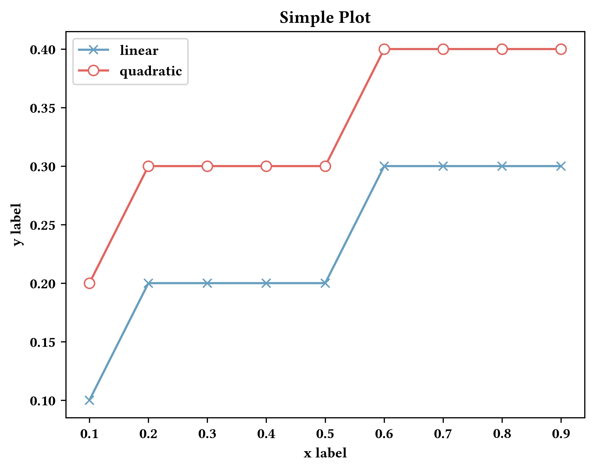

# scientific_python_plot_figure

 

The fonts are time new romans

We provide a simple but effective code of three types of figures used frequently in paper.

### 1. bar figure

### 2. dot line figure

### 3. line figure

